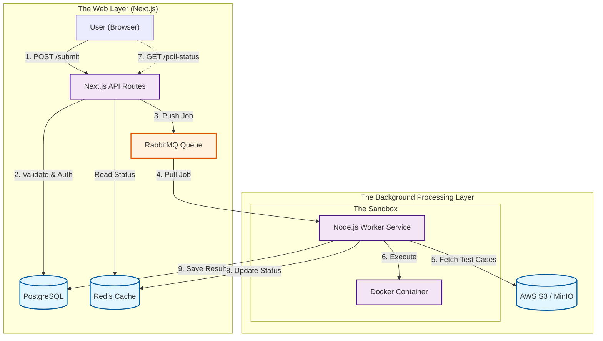

```mermaid

flowchart TD
    User["User (Browser)"]
    
    subgraph web["The Web Layer (Next.js)"]
        NextJS["Next.js API Routes"]
        
        %% User Interactions
        User -->|1. POST /submit| NextJS
        User -.->|7. GET /poll-status| NextJS
        
        %% Web Layer Logic
        NextJS -->|2. Validate & Auth| Postgres[("PostgreSQL")]
        NextJS -->|3. Push Job| RabbitMQ["RabbitMQ Queue"]
        NextJS -->|Read Status| Redis[("Redis Cache")]
    end

    subgraph background["The Background Processing Layer"]
        RabbitMQ -->|4. Pull Job| Worker["Node.js Worker Service"]
        
        %% Worker Resources
        Worker -->|5. Fetch Test Cases| S3[("AWS S3 / MinIO")]
        
        subgraph sandbox["The Sandbox"]
            Worker -->|6. Execute| Docker["Docker Container"]
        end
        
        %% Worker Outputs
        Worker -->|8. Update Status| Redis
        Worker -->|9. Save Result| Postgres
    end
    
    %% Styling for better visibility
    classDef database fill:#e1f5fe,stroke:#01579b,stroke-width:2px;
    classDef queue fill:#fff3e0,stroke:#e65100,stroke-width:2px;
    classDef component fill:#f3e5f5,stroke:#4a148c,stroke-width:2px;
    
    class Postgres,Redis,S3 database;
    class RabbitMQ queue;
    class NextJS,Worker,Docker component;

```